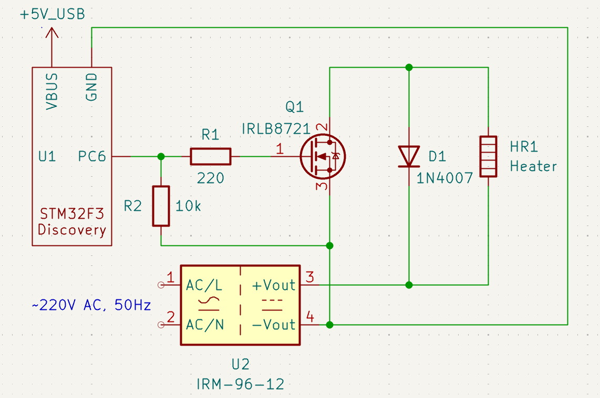
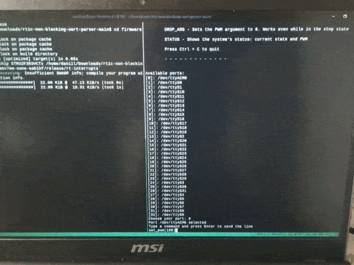

A non-blocking, interrupt-driven UART parser with a CRC16 implementation, operating a heater via PWM on a bare-metal STM32F3Discovery board. Built in Rust with the RTIC framework, using the HAL only partially (DMA, PWM, CRC16, and EXTI0 interrupt-flag clearing are implemented via direct register access).

## What it does

The system parses a command such as `SET_PWM(100)`, sent by an operator who typed it into the host script's serial terminal. Before executing the command, the system compares two checksums: one calculated on the host side, which is assumed correct since it reflects exactly what the operator typed, and another received by the MCU over UART and computed via the hardware CRC peripheral. If they match, the system accepts the command and drives the heater using a hardware timer; otherwise it rejects the command and reports a CRC error, which is also duplicated in the RTT console. To stop execution, the operator must send the `STOP` command over the serial terminal or press the physical emergency stop button, which generates an interrupt-driven event.

## Hardware (prototype-grade)

During the build, the electronic circuit was developed using the following parts list:
* STM32F3Discovery board
* IRLB8721 MOSFET
* Heater, 60 W (12 V, 5 A)
* Power supply, 96 W (12 V, 8 A)
* 1N4007 diode
* 10 kΩ and 220 Ω resistors
* Perfboard




**Wiring reasoning:** common ground between the MCU and the isolated supply, a protective diode across the heater/Drain path, R1 limiting gate current, and R2 holding the gate at a safe default before firmware configures the pins. A MOSFET was chosen over a BJT specifically because logic-level gate drive allows direct GPIO control through a simple resistor network, avoiding the extra base-driver stage a BJT would require at this current level.

**Safety notice:** the supply's primary side is 220 V mains, and the circuit has no fuse or over-temperature cutoff. **Never leave unattended.**

## Architecture

A task with the highest priority can preempt a lower one.
- **idle** - sets the duty cycle by writing the value into the `TIMx_CCR1` register and executes the `WFI` (wait for interrupt) instruction to enter Sleep mode.
- **uart_parser** (priority 1) - a software async task that parses the received line and applies the corresponding command.
- **uart_rx** (priority 2) - a hardware task triggered when USART1 sets the IDLE interrupt. Once the operator sends anything (e.g. a random burst of bytes) over the serial terminal, DMA silently writes the bytes into a static memory buffer, decrementing its internal counter by 1 after each byte transfer (from the USART data register into the static memory buffer). After DMA transfers the last byte, the receiver detects that the line has been idle for one entire frame and raises the IDLE interrupt. The CPU then reads the DMA's counter by accessing the `DMAx_CNDTR` register and calculates `delta` - how many new bytes arrived. Using the buffer's known memory address and the starting byte index, the program reads out the newly arrived bytes and spawns the `uart_parser` task with them.
- **stop_button** (priority 3) - a hardware task that preempts any other task when the EXTI0 interrupt fires. This task stops the PWM by forcing the output pin LOW. EXTI0 fires if the emergency stop button is pressed or the `STOP` command is sent. Once the task returns, execution falls back to whichever lower-priority task was preempted - typically `idle`, which re-enters Sleep mode via `WFI`.

## Why no HAL

Several modules were implemented via direct register access because the HAL either doesn't provide the necessary functionality at all, or its implementation is deprecated and flagged as unsafe.
### DMA
The HAL's API only supports fixed-length buffers, but the system is designed to handle variable-length buffers via circular DMA mode, which reduces CPU overhead.
### CRC
There is no HAL implementation for the CRC peripheral at all. The CRC register block was therefore configured directly for the standard CRC-16/CCITT-FALSE algorithm, and the checksum is computed by feeding the whole command through the peripheral byte by byte.
### PWM
Since the HAL's maintainers themselves state that the PWM implementation "is hard to maintain and not easy to verify if it is really a safe implementation," a decision was made to configure PWM directly using the TIMx registers.

## Command protocol

An operator can type commands in upper or lower case - the command is automatically converted to upper case.
### List of commands:

| Command      | Description                                                                                                                                                         |
| ------------ | --------------------------------------------------------------------------------------------------------------------------------------------------------------- |
| SET_PWM(arg) | Sets the PWM duty cycle depending on the value of `arg`.<br>Note: `arg` must be in the range `0..=100`.                                                            |
| STOP         | Stops the PWM entirely, so the next incoming `SET_PWM()` command can't be executed until PWM is resumed.                                                           |
| RESUME       | Resumes the PWM.                                                                                                                                                   |
| DROP_ARG     | Sets the PWM argument to 0. Works even while in the stop state. Useful for dropping the argument to a safe value after an emergency stop, without relaunching the program. |
| STATUS       | Shows the system's status: current state and PWM value.                                                                                                            |

Before transmission, the checksum calculated on the host side is appended to the command using a `*XXXX` suffix, where `XXXX` is a four-digit hexadecimal number. It uses the standard CRC-16/CCITT-FALSE algorithm to detect data corruption - a real failure mode that was actually observed during debugging, caused by a loose dupont-wire connection.

## Safety design

The program provides a stop button design that acts as an emergency switch: if the button is pressed, the system interrupts the execution of any command. The `STOP` command does exactly the same thing. During the stop state, the `SET_PWM` command is unavailable, but `DROP_ARG` still works, letting an operator zero a dangerous duty value before resuming. To make the stop state genuinely safe, the force-inactive PWM mode guarantees the output goes low on stop. To continue operating, the user must send an acknowledgment by transmitting the `RESUME` command over the serial terminal.

## Companion tool

To compute the corresponding checksum on the host side before transmitting a command, it was necessary to implement a serial listener script, where an operator can select their COM port, send commands, and receive feedback interactively. To implement this, a two-thread design was used.

At the start, a list of all available COM ports is provided to the user. After selection, the program is divided into two threads:
* **Read thread:** reads the feedback that the MCU sent. Can be killed after exiting or restarting the Write thread.
* **Write thread:** sends formatted user input from stdin over the serial terminal. After the operator submits a line, the corresponding checksum is computed on the host side and the formatted line is sent over the serial terminal. Stops the Read thread before exiting or restarting.

## Build & flash instructions

Before building, it's mandatory to install probe-rs first - an embedded debugging toolkit written in Rust.

```
cargo binstall probe-rs-tools
```

If you have a working Rust toolchain, you can just run this command:

```
cargo install probe-rs-tools --locked
```

For any help, visit probe-rs' official installation page:
https://probe.rs/docs/getting-started/installation/

After installation, Linux users should check the udev rules for their device.
Find the bus and device number:

```
lsusb
```

Then check the permissions:

```
ls -la /dev/bus/usb/[Bus_Number]/[Device_Number]
```

Expected output:

```
crw-rw-rw- ...
```

If you see something different, check this guide:
https://github.com/Mr-Monwe/Udev-Rules

You can't launch the firmware and the serial listener in the same terminal window.
Open the first terminal window and navigate to the program's directory. Then run:

```
cd firmware
cargo run --release
```

Then open another window and run the serial listener script:

```
cd serial_host
cargo run --release
```

Linux users can also split the terminal window using the third-party app `tmux`, by running a single command from the project's root directory:
```
tmux new-session -d -s build \; send-keys 'cd firmware && cargo run --release' C-m \; split-window -h \; send-keys 'cd serial_host && cargo run --release' C-m \; attach
```

## Testing

The first hardware tests were conducted using the on-board LED and the HAL's PWM function on TIM1. This covered the core program logic, including UART transmission/reception, DMA writes, emergency stop handling, command parsing, and PWM output.

For the final tests, the electronic circuit with the heater was soldered, the HAL's PWM function was abandoned, and TIM3 was configured directly, with the related PWM logic refactored accordingly.

To catch parsing edge cases, unit tests were written using Rust's own built-in test framework (`cargo test`).

**Not all edge cases of the serial listener script are covered by tests**, as this falls outside the project's scope.

## What was hard / known limitations

This section covers problems encountered during the project's development:
* **RXNE vs. IDLE interrupt misunderstanding** - at the very start, the system was designed to handle the RXNE interrupt (receive-data-register-not-empty, meaning a byte is ready to read), but this approach was rejected due to the CPU overhead of triggering an interrupt on every byte.
* **Static buffer size selection** - the current implementation trades a small amount of extra SRAM for reduced interrupt-driven CPU overhead, since the extra SRAM usage is negligible. A smaller buffer is possible, but it would increase CPU involvement.
* **Variable-length buffer DMA reception** - the HAL's API only supports fixed-length buffers. To handle a variable-length buffer, it was necessary to configure circular DMA mode instead, meaning the `DMAx_CNDTR` register automatically reloads to its initial value once it reaches zero. Since the CPU has no direct way to know how many bytes DMA has moved into memory, it's necessary to track the `CNDTR` value by reading the register before and after each transmission (*note: the first `CNDTR` read happens in the `init` task, to avoid a theoretical race condition in the window between the channel starting and this first read, where a byte could already have arrived and decremented `CNDTR`*). A simple subtraction between the last and current `CNDTR` values was tried first, but rejected - it produced negative numbers whenever the counter wrapped around. A modular delta formula was implemented instead: `Δ = (last + N - current) mod N`, where `N` is the buffer size.
* **Host-side checksum calculation** - since only a single program can hold a serial port open at once, it was impossible to run PuTTY and a small checksum-calculation script against the same port simultaneously. This made it necessary to abandon PuTTY and build a custom serial listener instead.
* **PWM disabling** - stopping PWM safely requires more than just halting the internal counter; the output must also be forced to its inactive level, since disabling the counter alone can leave the pin frozen high mid-cycle.
* **Splitting hardware and software logic for unit testing** - this required substantial restructuring using `#[cfg(test)]` and `#[cfg(not(test))]` attributes, but it was worth it, since it caught several real edge cases.
* **R2 resoldering** - the wrong resistor value was used for R2 on the first attempt (10 Ω instead of 10 kΩ). This was caught by measuring the voltage between the pin and the MOSFET's gate with a multimeter.

Known limitations:
* The CRC protocol validates only inbound commands but does not protect outbound feedback - a line degraded enough to corrupt a received command could also corrupt the error message reporting it. Bidirectional acknowledgment was considered out of scope for this build. CRC errors are therefore also duplicated in the RTT console.
* Spurious `uart_rx` firing right after `init` - does not affect normal operation, but the root cause hasn't been fully diagnosed yet.

## Possible future work

- DMA-based CRC computation: ST documents this as a memory-to-memory back-to-back DMA transfer into `CRC_DR` (see AN4187). Their own benchmarks show a real benefit at large buffer sizes (8192 words: CPU load drops from 100% to 0.72%), but the fixed DMA setup/teardown cost likely outweighs the gain at this project's ~32-byte command buffer. Worth revisiting if buffer sizes grow significantly.
- A safe Rust API over the unsafe C CAN driver core with a correctly handled `#[repr(C)]` boundary.

## Showcase

